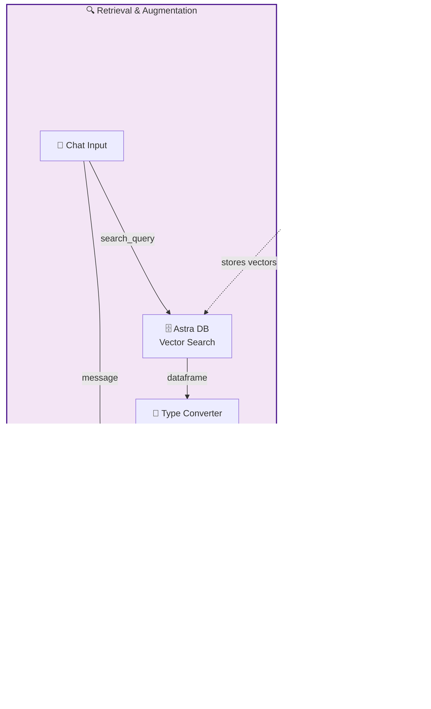
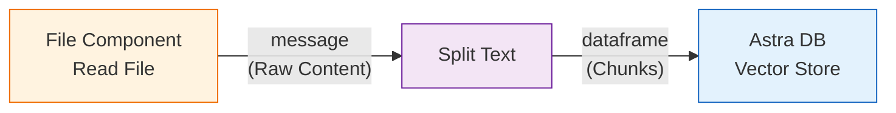
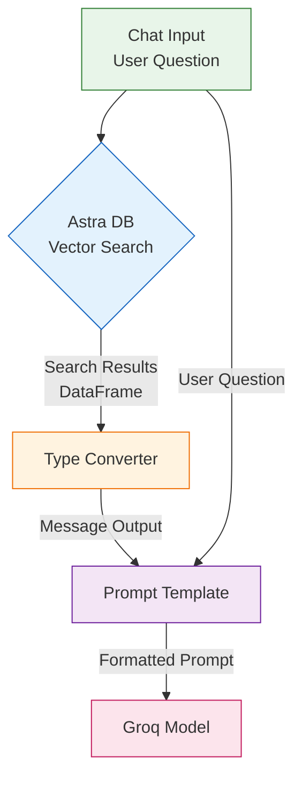
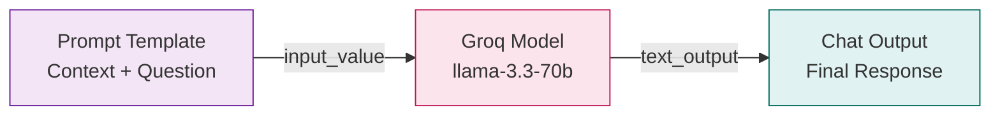
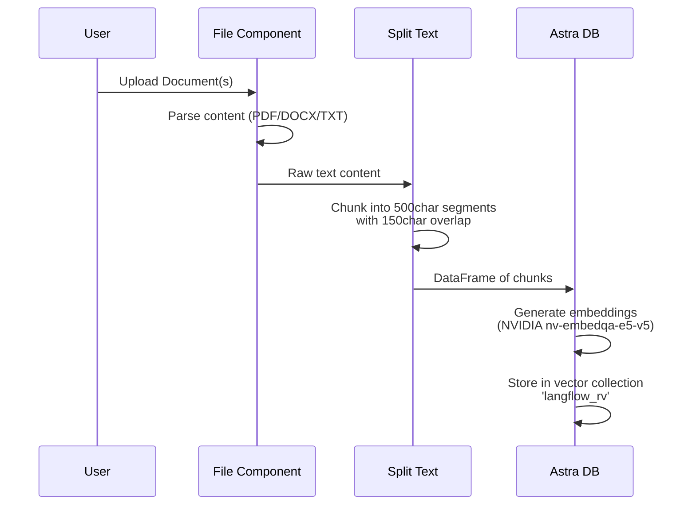
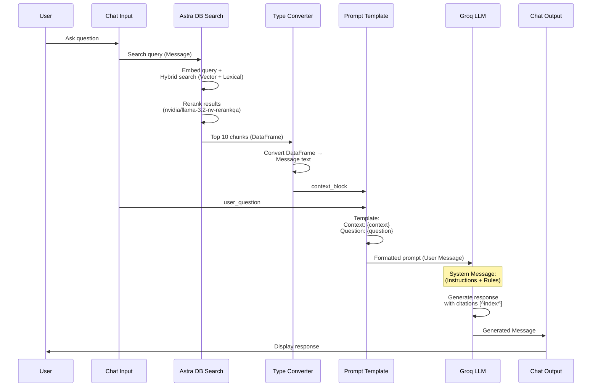

```markdown
# 🤖 RAG Knowledge Assistant

A production-ready Retrieval-Augmented Generation (RAG) pipeline built with Langflow, featuring document ingestion, vector search with Astra DB, and intelligent response generation using Groq LLMs.


## 📑 Table of Contents
- [Architecture Overview](#architecture-overview)
- [Pipeline Components](#pipeline-components)
- [Data Flow](#data-flow)
- [Configuration](#configuration)
- [System Prompt](#system-prompt)
- [Usage](#usage)

---

## 🏗️ Architecture Overview

This RAG system implements a two-stage architecture: **Ingestion** and **Retrieval/Generation**.



---

## 🔧 Pipeline Components

### 1. Document Ingestion Phase



| Component | Purpose | Configuration |
|-----------|---------|---------------|
| **Read File** | Loads documents (PDF, DOCX, TXT, etc.) | Advanced parser enabled for complex formats |
| **Split Text** | Chunks documents into manageable pieces | Chunk size: 500, Overlap: 150 |
| **Astra DB** | Vector storage and embedding | NVIDIA embeddings, Hybrid Search enabled |

### 2. Query Processing Phase



| Component | Purpose | Details |
|-----------|---------|---------|
| **Chat Input** | Receives user queries | Session management enabled |
| **Astra DB Search** | Semantic + Hybrid search | Returns top 10 relevant chunks |
| **Type Converter** | DataFrame → Message | Converts search results to text format |
| **Prompt Template** | Context assembly | Injects context + question into template |

### 3. Generation Phase



---

## 🔄 Detailed Data Flow

### Ingestion Flow (One-time setup)



### Query Flow (Runtime)



---

## ⚙️ Configuration

### Prompt Template Structure

```text
Context: {context_block}

Question: {user_question}
```

**Note**: The `context_block` variable receives the concatenated text from the retrieved vector search results, and `user_question` receives the original query from Chat Input.

### Groq Model Settings

| Parameter | Value | Description |
|-----------|-------|-------------|
| **Model** | `llama-3.3-70b-versatile` | High-performance LLM for RAG |
| **Temperature** | 0.1 | Low creativity, high factuality |
| **Max Tokens** | - | Model default (adjust as needed) |
| **Tool Models** | Enabled | For future agent capabilities |

### Astra DB Configuration

```yaml
Database: rv_db
Collection: langflow_rv
Embedding Provider: NVIDIA (nvidia/nv-embedqa-e5-v5)
Dimensions: 1024
Search Method: Hybrid Search (Vector + Lexical)
Reranker: nvidia/llama-3.2-nv-rerankqa-1b-v2
Number of Results: 10
```

---

## 🧠 System Prompt

The system message provides strict instructions for the AI assistant. **Important**: This is a static system prompt (no template variables). Dynamic context and questions are passed through the user message via the Prompt Template.

<details>
<summary>Click to expand full System Message</summary>

```markdown
You are a helpful AI assistant with access to a specialized knowledge base. Your task is to answer user questions based STRICTLY on the provided context documents in the user message.

## CORE RULES

**1. Grounding Principle**
- ONLY use information explicitly stated in the retrieved context provided within the user message
- If the context doesn't contain the answer, say: "I don't have sufficient information to answer that based on the available documents."
- NEVER invent facts, citations, or page numbers not present in the context
- Do not use external knowledge or training data beyond what is provided in the context

**2. Citation Protocol (CRITICAL)**
- Cite every factual claim using [^index^] format immediately after the information
- The index corresponds to the document number provided in the Context section of the user message
- Example: "The system requires Python 3.8  and supports Linux distributions ."
- If multiple documents support the same claim, cite all: 
- If a citation cannot be mapped to specific context, omit it rather than guessing

**3. Context Handling**
- The user message will contain a "Context:" section with retrieved document chunks
- These represent the most relevant information retrieved for the query
- Documents may be partial excerpts; acknowledge limitations if context is fragmented
- Prioritize more recent dates if temporal conflicts exist in documents

**4. Response Structure**
- Direct answer first (2-3 sentences maximum)
- Follow with detailed explanation including specific citations
- "Sources" section at the end listing cited document references only
- If rejecting the query, explain what information would be needed to answer

## OUTPUT REQUIREMENTS

- **Tone**: Professional, concise, objective, and helpful
- **Length**: Comprehensive but no fluff (3-5 paragraphs max unless query is complex)
- **Formatting**: Use markdown (bolding, bullet points) for readability
- **Prohibited Phrases**: Never use "Based on the context provided...", "According to the documents...", or similar meta-commentary. Just answer directly.

**Confidence Levels**:
- HIGH: Explicit match in authoritative document with clear citation
- MEDIUM: Inference required across multiple documents or partial matches  
- LOW: Ambiguous context or incomplete information (state this explicitly)

**Remember**: The user message contains both the Context (retrieved documents) and the Question. Use only the Context section to formulate your answer.
```
</details>

---

## 🚀 Usage

### 1. Ingest Documents
1. Upload files to the **File** component (supports PDF, DOCX, TXT, etc.)
2. Click "Run" to process and store in Astra DB
3. Monitor chunking in the **Split Text** component output

### 2. Query the Knowledge Base
1. Open the Chat Interface
2. Type your question
3. The system will:
   - Search relevant chunks using Hybrid Search
   - Assemble context + question in Prompt Template
   - Generate cited response using Groq

### Example Interaction

**User**: "What are the system requirements?"

**Assistant Response**:
> The system requires Python 3.8 or higher  and is compatible with Linux distributions including Ubuntu 20.04 . Additionally, 8GB RAM is recommended for optimal performance .
>
> **Sources**
> -  Installation Guide, Page 1
> -  System Requirements Doc, Page 4  
> -  Performance Tuning Guide, Page 2

---

## 🛠️ Technical Stack

- **Orchestration**: Langflow 1.7.1
- **Vector Database**: DataStax Astra DB
- **Embeddings**: NVIDIA NV-Embed-QA-E5-v5
- **LLM**: Groq (Llama 3.3 70B)
- **Reranking**: NVIDIA Llama 3.2 NV-RerankQA 1B v2
- **Text Processing**: LangChain Text Splitters

---

## 📊 Performance Notes

- **Chunking**: 500 char chunks with 150 overlap balances context window vs. granularity
- **Hybrid Search**: Combines vector similarity with lexical matching for better recall
- **Reranking**: Post-retrieval reranking improves precision of top-10 results
- **Temperature 0.1**: Ensures consistent, factual responses suitable for enterprise RAG

---

## 📝 License

MIT License - Feel free to modify and deploy in your own environments.

## 🤝 Contributing

To extend this flow:
1. Add more file types in the File component
2. Adjust chunk sizes based on your document structure  
3. Fine-tune the system prompt for your domain
4. Add evaluation components for RAG metrics
```
